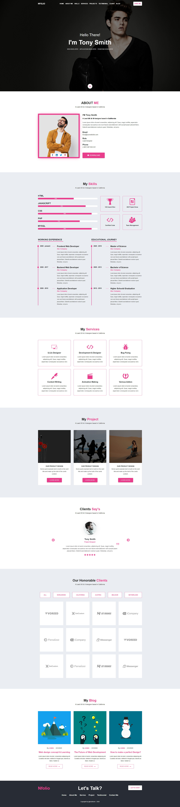

# React-Folio-Template
This is a personal template that is made it react js, sass, and modern libraries. If you are a UI, UX designer, Web developer, Programmer, DevOps engineer, and any other profession. You can use it easily.

# Installation Process

1. Node Install
2. React install
3. open package.json file than-> see the dependencies
4. Need to all packages install 

Please play the screenshot of Folio Template 

